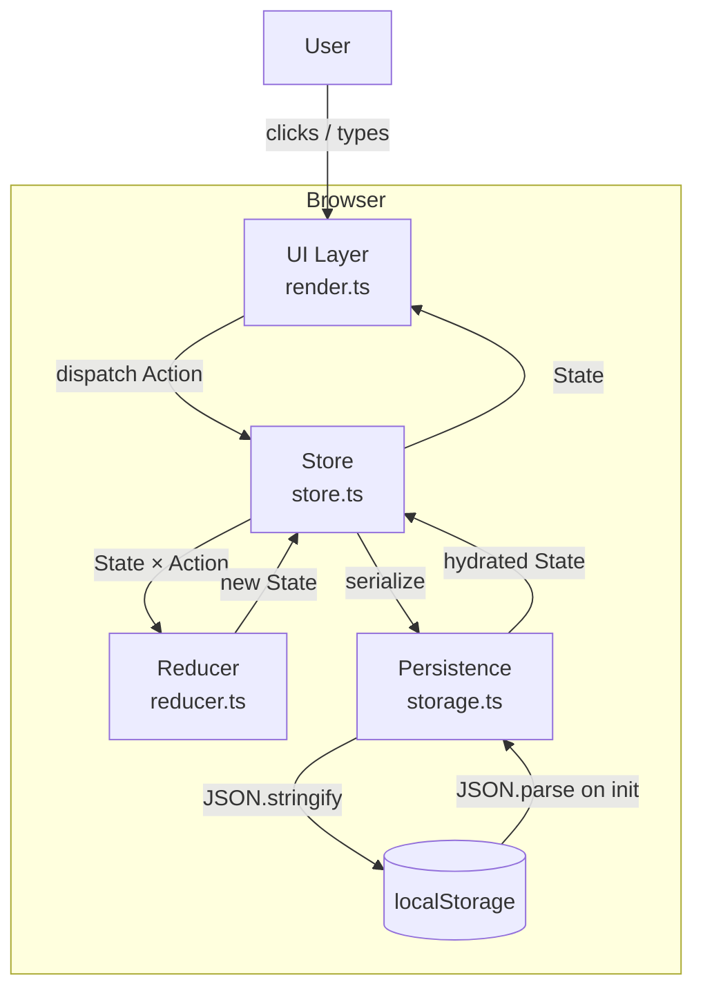

# Design Document — Todo List App

## Overview

The Todo List App is a client-side single-page application (SPA) that runs entirely in the browser. It provides task creation, viewing, editing, deletion, completion toggling, status filtering, and automatic persistence via the browser's `localStorage` API.

There is no backend. All state lives in memory during a session and is serialised to `localStorage` on every mutation so tasks survive page reloads.

**Technology choices:**
- **Vanilla TypeScript** — compiled to a single JS bundle. No framework dependency keeps the build simple and the output portable.
- **Vite** — fast development server and bundler, minimal configuration.
- **Vitest** — test runner, compatible with Vite; used for unit and property-based tests.
- **fast-check** — property-based testing library for TypeScript/JavaScript.
- **HTML5 + CSS3** — semantic markup, no CSS framework.

---

## Architecture

The app follows a **unidirectional data-flow** pattern inspired by the Flux/Redux model, adapted to a lightweight vanilla-TS implementation:

```
User Event
    │
    ▼
Action (plain object)
    │
    ▼
Reducer (pure function: State × Action → State)
    │
    ▼
New State
    │
    ├──► localStorage (side effect — serialise)
    │
    └──► Render (pure function: State → DOM diff / re-render)
```

**Rationale:** Keeping the reducer pure (no side effects) makes it trivially testable and provides a single source of truth for correctness properties. Side effects (DOM updates and localStorage writes) are pushed to the edges.



### Module responsibilities

| Module | Responsibility |
|---|---|
| `main.ts` | Entry point — bootstraps store, wires DOM events |
| `store.ts` | Holds current state, exposes `dispatch` and `subscribe` |
| `reducer.ts` | Pure state-transition function |
| `storage.ts` | Read/write `localStorage`; JSON serialisation/deserialisation |
| `render.ts` | Reads state, produces DOM updates |
| `types.ts` | Shared TypeScript interfaces and type aliases |
| `validation.ts` | Title validation rules (shared by create and edit paths) |

---

## Components and Interfaces

### Task Form Component *(Neobrutalist style: thick black borders, hard shadow, yellow CTA)*

Rendered at the top of the page. Operates in two modes:

- **Create mode** — empty input, "Add" button, no cancel button.
- **Edit mode** — pre-filled input, "Save" button, "Cancel" button.

The active edit task ID is tracked in application state (`editingId`). Switching from editing one task to another discards unsaved changes by updating `editingId`.

```
┌─────────────────────────────────────────┐
│ [Task title input ..................... ] │
│                         [Cancel] [Save]  │
│ ⚠ Validation error message              │
└─────────────────────────────────────────┘
```

### Task List Component *(Neobrutalist style: thick black borders, hard shadow, yellow CTA)*

Displays tasks filtered by the active filter option, in reverse chronological order.

Each task item renders:
- Checkbox / toggle (completion control)
- Title text (with `text-decoration: line-through` when complete)
- Edit button
- Delete button

Empty state message is shown when the filtered list is empty.

### Filter Bar Component *(Neobrutalist style: thick black borders, hard shadow, yellow CTA)*

Three buttons / tabs: **All** | **Active** | **Completed**. The active selection is highlighted. Default is "All".

---

## Visual Design — Neobrutalist Style

The app uses a Neobrutalist visual style: raw, high-contrast, and unapologetically flat. No gradients, no border-radius, no blurred shadows.

### Design Tokens

| Token | Value | Usage |
|---|---|---|
| `--color-black` | `#000000` | Borders, text, shadows |
| `--color-white` | `#FFFFFF` | Card backgrounds, inactive buttons |
| `--color-yellow` | `#FFE000` | Primary CTA (Add/Save), active filter tab |
| `--color-pink` | `#FF3EA5` | Delete button, error banner background |
| `--color-bg` | `#F5F5F5` | Page background |
| `--color-text-muted` | `#666666` | Completed task title |
| `--border` | `2px solid #000` | Standard border on all elements |
| `--border-thick` | `4px solid #000` | Card / section borders |
| `--shadow` | `4px 4px 0 #000` | Resting hard shadow |
| `--shadow-press` | `2px 2px 0 #000` | Pressed/hover shadow |
| `--font-heading` | `'Arial Black', Arial, sans-serif` | App title, section labels |
| `--font-body` | `Arial, sans-serif` | Task titles, buttons, labels |
| `--font-input` | `monospace` | Task title input field |

### Component Styles

**Task Form card**
- Background: `--color-white`
- Border: `--border-thick`
- Box shadow: `--shadow`
- Border-radius: `0`
- Input field: `--border` border, `--font-input`, white background
- Add/Save button: `--color-yellow` background, `--border`, `--shadow`; on hover/active → translate `2px 2px`, `--shadow-press`
- Cancel button: white background, `--border`, `--shadow`

**Filter Bar**
- Container border: `--border-thick`, `--shadow`
- Inactive tab: white background, `--border`
- Active tab: `--color-yellow` background, `--border`; bold text
- Hover on inactive: background `#f0f0f0`

**Task List item**
- Row bottom border: `1px solid #000`
- Last item: no bottom border
- Checkbox: native, styled with `accent-color: #FFE000`
- Edit button: white background, `--border`, `--shadow`; hover → press effect
- Delete button: `--color-pink` background, `--border`, `--shadow`; hover → press effect
- Completed title: `text-decoration: line-through`, color `--color-text-muted`

**Error Banner**
- Background: `--color-pink`
- Border: `--border-thick`
- Box shadow: `--shadow`
- Text: black, bold
- Dismiss button: white background, `--border`

**Empty State**
- Text: bold black, centered, `--font-heading`

### Interaction Patterns

Buttons and interactive cards use a consistent "press" animation: on `:hover` or `:active`, the element shifts `transform: translate(2px, 2px)` and the box shadow shrinks from `--shadow` to `--shadow-press`. This simulates physical depression without transitions (instant snap for a brutalist feel).

Validation errors appear inline below the input in bold black text with a `--color-pink` left border (`4px solid #FF3EA5`).

---

## Data Models

### `Task`

```typescript
interface Task {
  id: string;           // UUID v4, generated at creation time
  title: string;        // trimmed, 1–255 characters
  completed: boolean;   // false on creation
  createdAt: string;    // ISO 8601 string (new Date().toISOString())
}
```

### `FilterOption`

```typescript
type FilterOption = 'all' | 'active' | 'completed';
```

### `AppState`

```typescript
interface AppState {
  tasks: Task[];              // ordered: most recently created first
  filter: FilterOption;       // currently active filter
  editingId: string | null;   // ID of task in edit mode, or null
  error: string | null;       // transient error message, or null
}
```

### Actions

```typescript
type Action =
  | { type: 'ADD_TASK';    payload: { title: string } }
  | { type: 'DELETE_TASK'; payload: { id: string } }
  | { type: 'TOGGLE_TASK'; payload: { id: string } }
  | { type: 'EDIT_START';  payload: { id: string } }
  | { type: 'EDIT_SAVE';   payload: { id: string; title: string } }
  | { type: 'EDIT_CANCEL' }
  | { type: 'SET_FILTER';  payload: { filter: FilterOption } }
  | { type: 'HYDRATE';     payload: { tasks: Task[] } }
  | { type: 'CLEAR_ERROR' };
```

### LocalStorage Schema

```
Key:   "todolist-app-tasks"
Value: JSON.stringify(Task[])   // array of Task objects
```

Only the `tasks` array is persisted. `filter`, `editingId`, and `error` are transient session state and reset to defaults on each page load.

---

## Correctness Properties

*A property is a characteristic or behavior that should hold true across all valid executions of a system — essentially, a formal statement about what the system should do. Properties serve as the bridge between human-readable specifications and machine-verifiable correctness guarantees.*

### Property 1: Valid task creation prepends to list

*For any* existing task list and any non-empty, non-whitespace-only title of at most 255 characters, dispatching `ADD_TASK` must result in a task list whose length is exactly one greater than before, with the newly created task at index 0 and all previously existing tasks retained at their prior relative positions (shifted by one index).

**Validates: Requirements 1.2, 1.4, 2.1**

### Property 2: Whitespace-only and empty titles are rejected

*For any* string composed entirely of whitespace characters (including the empty string), dispatching `ADD_TASK` with that title must leave the task list unchanged.

**Validates: Requirements 1.3**

### Property 3: Title length boundary enforcement

*For any* title whose length exceeds 255 characters, dispatching `ADD_TASK` must leave the task list unchanged.

**Validates: Requirements 1.5**

### Property 4: Toggle is its own inverse (round-trip)

*For any* task, toggling its completion status twice must return the task to its original completion status, leaving all other task fields unchanged.

**Validates: Requirements 3.2, 3.3**

### Property 5: Edit preserves identity and metadata

*For any* task and any valid new title, dispatching `EDIT_SAVE` must update only the task's title and leave the task's `id`, `completed` status, and `createdAt` timestamp unchanged.

**Validates: Requirements 5.3**

### Property 6: Filter correctness — Active

*For any* task list and any sequence of filter-setting actions, when the active filter is "Active", every task visible in the derived view must have `completed === false`, and every task in the full list with `completed === false` must appear in the derived view.

**Validates: Requirements 6.3**

### Property 7: Filter correctness — Completed

*For any* task list and any sequence of filter-setting actions, when the active filter is "Completed", every task visible in the derived view must have `completed === true`, and every task in the full list with `completed === true` must appear in the derived view.

**Validates: Requirements 6.4**

### Property 8: localStorage serialisation round-trip

*For any* array of `Task` objects, serialising the array to a JSON string and then deserialising it must produce an array that is deeply equal to the original, with all fields (`id`, `title`, `completed`, `createdAt`) intact.

**Validates: Requirements 7.1, 7.2**

### Property 9: Deletion removes exactly one task

*For any* task list containing at least one task, dispatching `DELETE_TASK` for a valid task ID must result in a task list whose length is exactly one less than before, and the deleted task must no longer be present.

**Validates: Requirements 4.2**

---

## Error Handling

| Failure scenario | Detection | Response |
|---|---|---|
| Empty / whitespace title submitted | `validation.ts` check before dispatch | Inline error adjacent to input; no state change |
| Title exceeds 255 chars | `validation.ts` check before dispatch | Inline error adjacent to input; no state change |
| `localStorage.setItem` throws (quota exceeded or security error) | `try/catch` in `storage.ts` | Set `error` in state; display error banner; in-memory state unchanged |
| `localStorage.getItem` returns malformed JSON | `try/catch` around `JSON.parse` in `storage.ts` | Discard data, initialise with empty task list, set `error` in state; display error banner |
| `localStorage.getItem` returns `null` (no prior data) | `null` check in `storage.ts` | Initialise with empty task list (no error) |
| `TOGGLE_TASK` for a non-existent ID | Guard in reducer | No-op; state unchanged |
| `DELETE_TASK` for a non-existent ID | Guard in reducer | No-op; state unchanged |

All transient errors are stored in `AppState.error`. The render layer displays the error banner whenever `error !== null`. A `CLEAR_ERROR` action resets it (e.g. on next successful operation or on manual dismiss).

---

## Testing Strategy

### Unit Tests (Vitest)

Unit tests cover the pure logic layers where behaviour is driven by specific examples or edge conditions:

- **`reducer.ts`** — one test per action type for representative inputs; boundary conditions (toggle on complete vs incomplete; edit with valid vs invalid title; add duplicate-title task).
- **`validation.ts`** — specific examples: empty string, single space, 255-char string (valid boundary), 256-char string (invalid boundary), multi-line whitespace string.
- **`storage.ts`** — mock `localStorage`; test successful write, quota-exceeded error, `null` read, and malformed-JSON read.
- **`render.ts` (DOM snapshots)** — given a known state, assert the resulting DOM structure contains expected elements and text.

Unit tests should stay focused on specific examples and integration points. Property-based tests handle broad input coverage.

### Property-Based Tests (Vitest + fast-check)

Each property defined in the Correctness Properties section above is implemented as a single property-based test with a minimum of **100 iterations**. Each test is tagged with:

```
// Feature: todolist-app, Property N: <property_text>
```

**Generators required:**

- `arbitraryTitle` — `fc.string({ minLength: 1, maxLength: 255 }).filter(s => s.trim().length > 0)`
- `arbitraryWhitespaceTitle` — `fc.stringOf(fc.constantFrom(' ', '\t', '\n', '\r'))`
- `arbitraryTask` — `fc.record({ id: fc.uuid(), title: arbitraryTitle, completed: fc.boolean(), createdAt: fc.date().map(d => d.toISOString()) })`
- `arbitraryTaskList` — `fc.array(arbitraryTask)`
- `arbitraryValidFilter` — `fc.constantFrom('all', 'active', 'completed')`

**Tests to implement:**

| Test | Property | fast-check arbitraries |
|---|---|---|
| `valid task creation prepends to list` | Property 1 | `arbitraryTaskList`, `arbitraryTitle` |
| `whitespace title rejected` | Property 2 | `arbitraryTaskList`, `arbitraryWhitespaceTitle` |
| `title exceeds 255 chars rejected` | Property 3 | `arbitraryTaskList`, `fc.string({ minLength: 256 })` |
| `toggle is involution` | Property 4 | `arbitraryTask` |
| `edit preserves metadata` | Property 5 | `arbitraryTask`, `arbitraryTitle` |
| `active filter correctness` | Property 6 | `arbitraryTaskList` |
| `completed filter correctness` | Property 7 | `arbitraryTaskList` |
| `localStorage round-trip` | Property 8 | `arbitraryTaskList` |
| `deletion removes exactly one` | Property 9 | `fc.array(arbitraryTask, { minLength: 1 })` |

### Integration / Manual Tests

The following scenarios require a real browser environment and are validated manually or via a Playwright smoke test:

- Page load restores tasks from `localStorage` within 500 ms.
- localStorage quota error surfaces the error banner (simulate by mocking `localStorage.setItem` to throw).
- Switching filter while editing a task preserves edit mode and filter simultaneously.
- Activating edit on a second task while one is already being edited discards the first task's pending changes.
